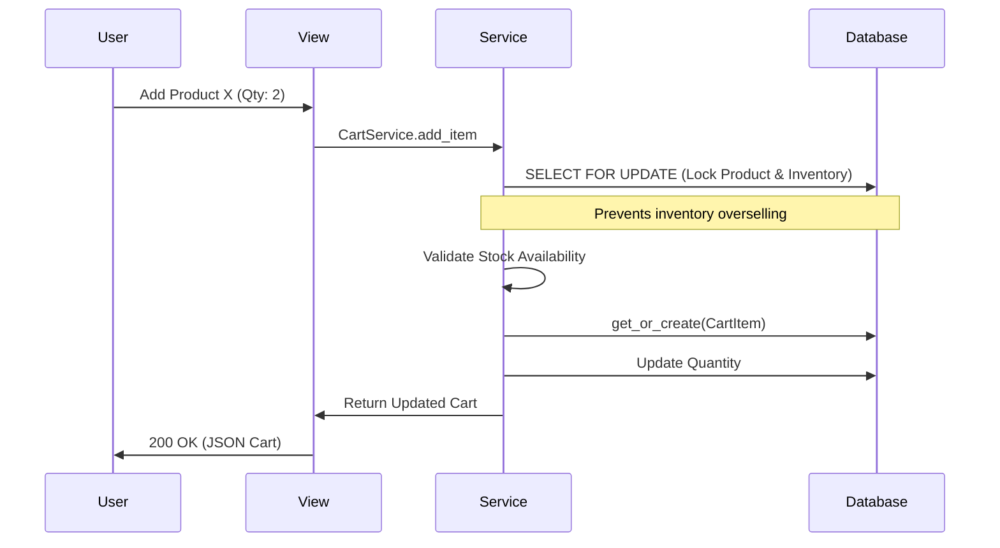

# Cart App - Complete Technical Documentation

> **Last Updated**: February 2026  
> **Author**: AI Pair Programmer  
> **Purpose**: This document explains the **thought process**, **why**, **what**, and **how** behind every component of the cart app.

---

## Table of Contents

1. [Philosophy & Design Decisions](#1-philosophy--design-decisions)
2. [Directory Structure](#2-directory-structure)
3. [Models Deep Dive](#3-models-deep-dive)
4. [Business Logic & Flows](#4-business-logic--flows)
5. [Services Layer & Optimization](#5-services-layer--optimization)
6. [Permissions & Validation](#6-permissions--validation)
7. [API Endpoints](#7-api-endpoints)
8. [Common Questions](#8-common-questions)

---

## 1. Philosophy & Design Decisions

### 1.1 Why One-to-One Cart?

**The Problem**: Every user needs exactly one shopping cart. If we used a `ForeignKey`, we'd have to handle logic for "which cart is active?" or merge multiple carts.

**Our Solution**: We use a `OneToOneField` with the `User` model.
- **Why This Matters**: It simplifies the logic. `user.cart` always gives you exactly one object. No ambiguity.

### 1.2 Why Decoupled CartItems?

**The Design**: The `Cart` model is just a container. The actual products are stored in `CartItem` linked via `ForeignKey`.

**Thought Process**:
- A `Cart` can have many `Products`.
- Each `Product` in a cart needs a `quantity`.
- Using a many-to-many relationship with a `through` model (`CartItem`) is the standard way to store this metadata (quantity).

### 1.3 Handling "Ghost" Items (Product Deletion/Unpublishing)

**The Problem**: What happens to a user's cart if a product they added is deleted or unpublished by the admin?

**Our Solution**: 
- We **don't** automatically delete the item from the cart (that would be confusing for the user).
- Instead, we use `get_valid_items()` and `is_available` logic to "hide" or "disable" these items during checkout.
- We show the user a warning: "Some items in your cart are no longer available."

---

## 2. Directory Structure

```
apps/cart/
├── models.py           # Cart & CartItem models
├── services.py         # Atomic operations & prefetching optimization
├── serializers.py      # Cart & CartItem serializers
├── views.py            # API ViewSet for cart management
├── urls.py             # Internal routing
└── v1/
    └── urls.py         # Versioned API routing
```

---

## 3. Models Deep Dive

### 3.1 Cart Model

**Location**: `models.py`

| Property | Type | Description |
|----------|------|-------------|
| `user` | OneToOne | Links the cart to a specific User. |
| `subtotal` | Property | Sum of (quantity * price) for all **valid** items. |
| `total_items`| Property | Sum of quantities for all **valid** items. |

**Key Method: `get_valid_items()`**
```python
def get_valid_items(self):
    return self.items.filter(
        product__is_deleted=False,
        product__status=STATUS_PUBLISHED,
    )
```
**Why?** This ensures that pricing and checkout logic only considers products that actually exist and are for sale.

### 3.2 CartItem Model

**Location**: `models.py`

| Field | Type | Description |
|-------|------|-------------|
| `cart` | ForeignKey | Links to the parent Cart. |
| `product` | ForeignKey | Links to the Product. |
| `quantity`| Integer | Number of units requested. |

**Unique Constraint**: `unique_together = ("cart", "product")`
- **Why?** One product should only appear once in a cart. If a user adds it again, we increment the `quantity` instead of creating a new row.

---

## 4. Business Logic & Flows

### 4.1 Adding to Cart (The "Atomic" Way)



**Why `select_for_update()`?**
In a high-traffic site, two users might add the last item to their cart at the exact same millisecond. DB locking ensures only one "wins" the stock validation.

---

## 5. Services Layer & Optimization

### 5.1 N+1 Query Prevention

**The Problem**: When you display a cart, you need the product name, price, category, brand, and primary image. A naive serializer would hit the database for **every single item**. (10 items = 50+ queries).

**Our Solution: `get_cart_with_items()`**
```python
cart, _ = Cart.objects.prefetch_related(
    Prefetch(
        "items",
        queryset=CartItem.objects.select_related(
            "product",
            "product__category",
            "product__brand",
            "product__inventory",
        ).prefetch_related(primary_image_prefetch),
    )
).get_or_create(user=user)
```
- **Result**: We fetch the entire cart, all items, and all related product data in **just 2-3 queries**.

---

## 6. Permissions & Validation

### 6.1 Permissions
- **IsAuthenticated**: User must be logged in.
- **IsCustomer**: Only customers have carts. Shopkeepers cannot add items to their own platform (prevents rigging).

### 6.2 Stock Validation
Validation happens in **three places** for maximum safety:
1. **Serializer**: Checks `product.inventory.available` during the request.
2. **Service**: Uses `select_for_update()` to re-check stock with a DB lock.
3. **Model `.save()`**: Final check to ensure quantity never exceeds stock.

---

## 7. API Endpoints

| Method | Endpoint | Description |
|--------|----------|-------------|
| GET | `/api/v1/cart/` | Fetch current user's cart. |
| POST | `/api/v1/cart/add_item/` | Add product. Body: `{"product_id": X, "quantity": Y}` |
| POST | `/api/v1/cart/update_item/` | Change quantity. Body: `{"item_id": X, "quantity": Y}` |
| POST | `/api/v1/cart/remove_item/` | Remove item. Body: `{"item_id": X}` |
| POST | `/api/v1/cart/clear/` | Delete all items in cart. |

---

## 8. Common Questions

### Q1: Why use `Decimal(str(result["total"]))`?
In Python, floating-point math is imprecise (e.g., `0.1 + 0.2 != 0.3`). For money, we always use the `Decimal` type to ensure absolute mathematical accuracy.

### Q2: Why is the cart created automatically?
We use `get_or_create` in the service layer. This means the frontend never has to worry about "Is there a cart yet?". It just requests the cart, and the backend handles the existence logic.

### Q3: How do we handle price changes?
Because `CartItem` links to `Product`, the price in the cart is always the **current** price. If the admin changes the price, the cart updates automatically. (Note: Once an order is placed, the price is "frozen" in the OrderItem model).

---

## Summary

The Cart app is built for **performance** and **consistency**:
✅ One-to-one user mapping for simplicity.  
✅ Atomic service layer for race-condition prevention.  
✅ Optimized prefetching to avoid N+1 query overhead.  
✅ Robust inventory validation at multiple layers.
